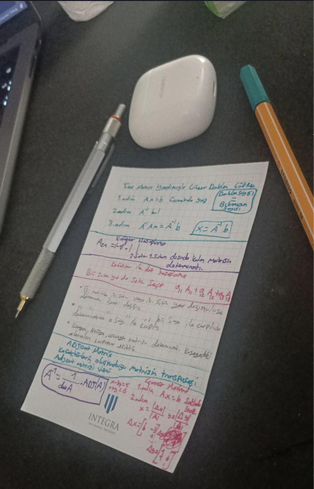
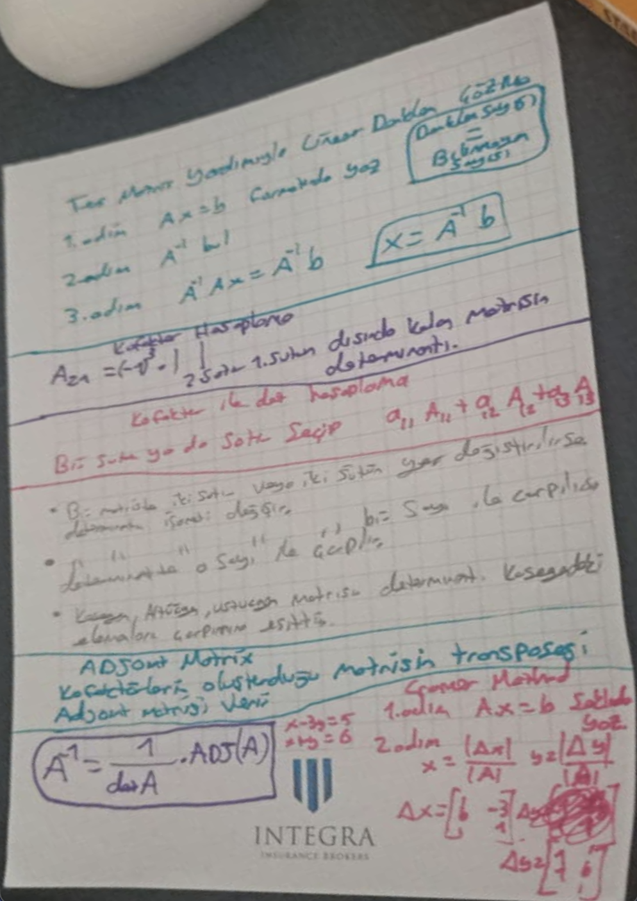
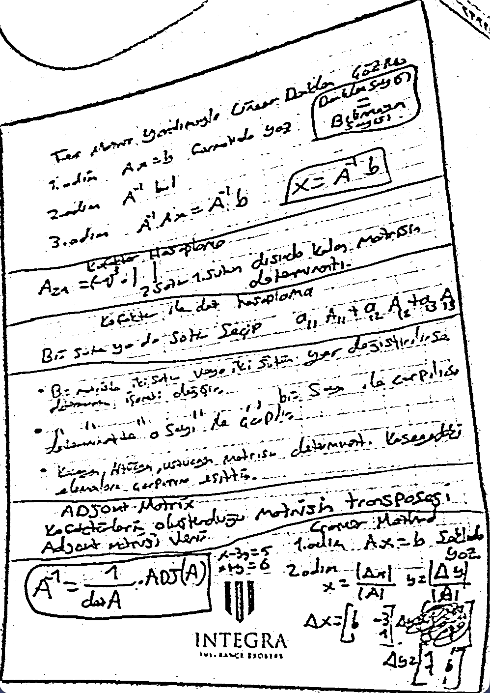

# 📄 Smart Document Scanner (C++ & OpenCV)

A computer vision application that transforms raw images of physical documents into scanned, digitized formats. This project replicates the core functionality of apps like CamScanner using **C++** and **OpenCV**, leveraging Linear Algebra concepts for image transformation.

## 🚀 Features
* **Automatic Edge Detection:** Identifies the document boundaries using Canny Edge Detection.
* **Perspective Correction:** Applies a 4-point perspective transform (Homography) to "flatten" the document image from an angled view to a top-down view.
* **Image Enhancement:** Uses adaptive thresholding to generate a clean, high-contrast, photocopy-like output.
* **Noise Reduction:** Implements Gaussian Blur and Morphological Dilation to ensure accurate contour detection.

## 🛠️ Tech Stack
* **Language:** C++ (Standard 17)
* **Library:** OpenCV 4.x
* **Build System:** CMake
* **IDE:** CLion / Visual Studio

## 🧠 How It Works (The Pipeline)
1.  **Preprocessing:** The image is converted to grayscale and blurred to reduce noise.
2.  **Edge Detection:** `Canny` algorithm highlights the edges.
3.  **Contour Analysis:** The algorithm searches for the largest closed shape with 4 corners (the document).
4.  **Warping:** A **Perspective Transformation Matrix** is calculated to map the document's corners to a flat rectangle.
5.  **Post-Processing:** The cropped image is binarized using Adaptive Thresholding for a clean look.

## 📸 Screenshots
| Original Image | Detected Document | Scanned Output |
| :---: | :---: | :---: |
|  |  |  |

## 👨‍💻 Author
Gökalp EKER
Computer Engineering Student
